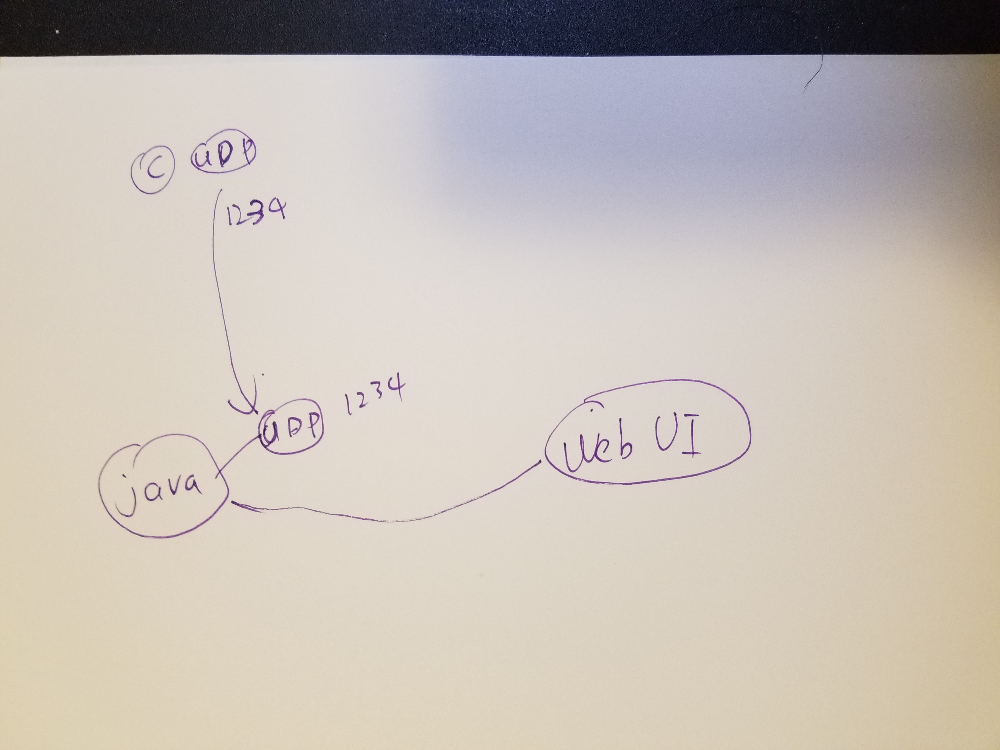
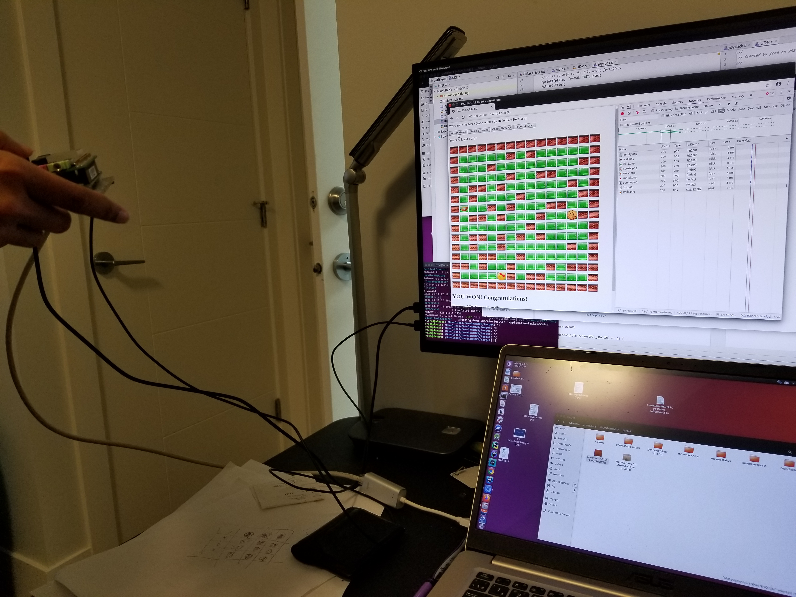
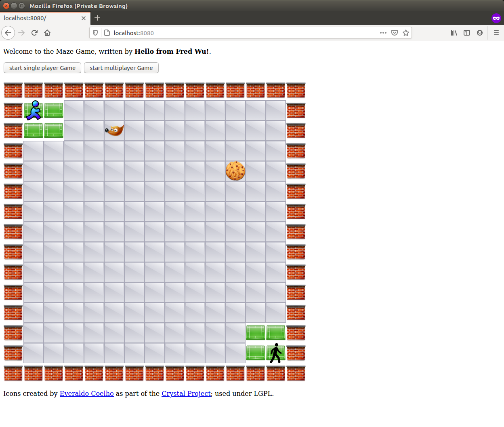

# Beaglebone & web MazeGame--App

this is a Embedded c & web MazeGame application implemented using spring boot as Embedded C

# demo link

https://www.youtube.com/watch?v=w5q0nAAb_kU&t=2s

# multiplayer mode UI

# production on AWS cloud
http://mazegamenew-env.eba-ru7ts3dm.ca-central-1.elasticbeanstalk.com/